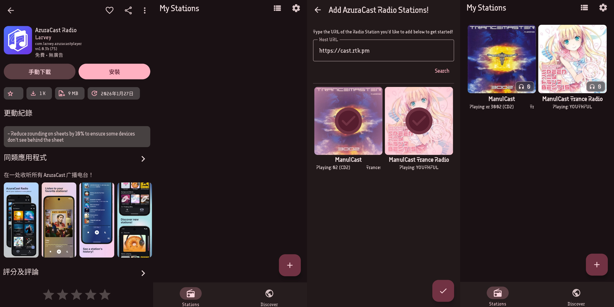

# ManulCast
某兔狲的个人电台

# 收听指南
## 网页收听
**ManulCast 主电台**：https://cast.rtk.pm/public/manulcast   
**ManulCast Trance 电台**： https://cast.rtk.pm/public/manulcast_trance_radio   

## APP收听
- 在**应用商店**获取 Azuracast Radio 应用：[App Store](https://apps.apple.com/cn/app/azuracast-radio/id6740510724)、[Google Play](https://play.google.com/store/apps/details?id=com.larvey.azuracastplayer)
- 点击右下角添加电台，复制 https://cast.rtk.pm/ 粘贴进地址栏，点击搜索就可以添加自己想要听的电台。
- 若无法通过官方渠道获取APP，可以使用 [MT 管理器](https://mt2.cn)安装[此处](https://wwbxb.lanzouw.com/iVV5i3mp8t0d)提供的 XAPK，但不保证是最新版本。   

## 第三方APP收听
如果有使用其他APP收听的需求（例如 Rhythm、PixelPlay、Symphony、VLC、WinAMP 等），需要打开 APP 的网络串流功能，然后复制你想听的电台的音频流并粘贴：   
**ManulCast 主电台**：https://cast.rtk.pm/public/manulcast/radio.mp3   
**ManulCast Trance 电台**： https://cast.rtk.pm/public/manulcast_trance_radio/radio.mp3   

# 电台说明
> 注意：此处所指的曲风仅依照该艺术家的主要曲风分类，并非绝对准确。目前已大规模收录的曲风包括 Trance House Techno 等，其他曲风尚在补充
- **ManulCast 主电台**：随机播放所有已收录的曲目，因此上下曲之间可能会有明显割裂
- **ManulCast Trance 电台**：随机播放所有已收录的 Trance 舞曲。包含 Ferry Corstan、Aly & Fila、Armin van Burren、Darude等作曲家的专辑
> 以下电台正在评估是否开启及运营时间
- **ManulCast Techno 电台**：随机播放所有已收录的 Techno 音乐。包含 Marusha、Lexy & K-Paul、Daft Punk、Steyoyoke等作曲家的专辑
- **ManulCast deadmau5-only 电台**：随机播放所有已收录的作曲家为 deadmau5 的歌曲
- **ManulCast ACG 电台**：随机播放所有已收录的 ACG 歌曲，包括明日方舟 OST、EXIT Trance、DanceDanceRevolution OST、Cytus OST等专辑

# 点歌相关
ManulCast不打算支持点歌功能，因为这会暴露额外的歌曲信息，并很可能包含曲目的音频文件。广播站的所有音乐都是个人收藏，需要规避版权问题。   
但你仍然可以使用Navidrome客户端连接到我的音乐库，此后可以自由收听想听的曲目。大部分曲目以最高音质（FLAC）提供，仍有一部分是MP3，请勿强求。   
连接到音乐库的功能将在评估需求后添加。   

# 贡献
本项目接受赞助，请移步至[Patreon](https://www.patreon.com/c/ManulCast)查看。   
如果你有独家的音乐资源，又或者想要现有资源的音质/覆盖面，请联系yuki.ark02[at]gmail.com。